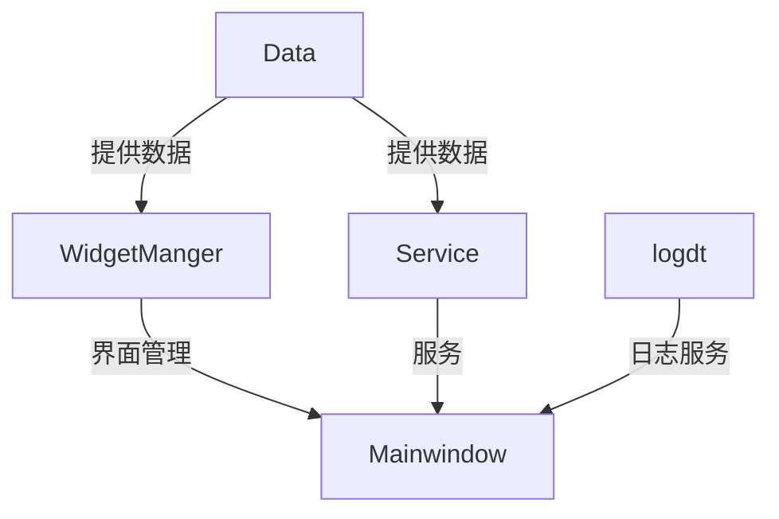

# 说明

自用工具箱

`feature`
- BTF包制作
- xml编辑器

`environment`

- qt5.14.2
- msvc2017_64(编译器)
- 7z.exe

结构图

```mermaid
graph TD
  WidgetManger--界面管理--> Mainwindow
  Service--服务-->Mainwindow
  logdt--日志服务-->Mainwindow
  Data--提供数据-->WidgetManger
  Data--提供数据-->Service
```

