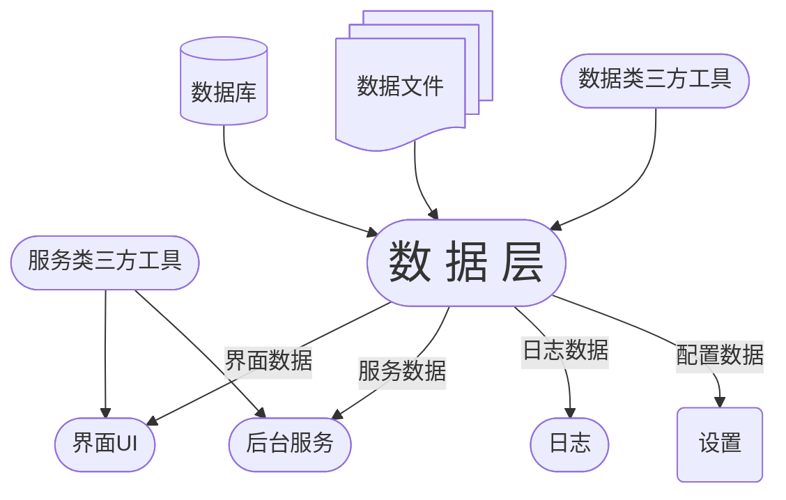

<h1 align=center>  DQToolKits </h1>

<i>Self-use toolbox.</i>

   
   
   
   
   

## :book: Introduction

这是一个用于收集我日常开发过程中自用工具的仓库，主要面向实际开发中遇到的各种效率问题与重复性工作。

工具箱以 C++ / Qt 开发环境 为核心，涵盖了一些轻量、实用、可复用的小工具与模块，旨在提升开发效率、简化流程，并减少重复劳动。

## :sparkles: Features
- 压缩包制作
- 数据文件分析
- xml编辑器

## :wrench: Build Environment

> - qt5.15.2
> - msvc2019_64
> - Cmake >= 3.16 or qmake
> - Ninja or jom

## :triangular_ruler: Structure

## :link: Acknowledgements
-  : 轻量级日志库

-  : Qt桌面应用的全局快捷键

-  : 轻量级QtSql头文件库

-  :  现代化C++开源高性能格式化库
   